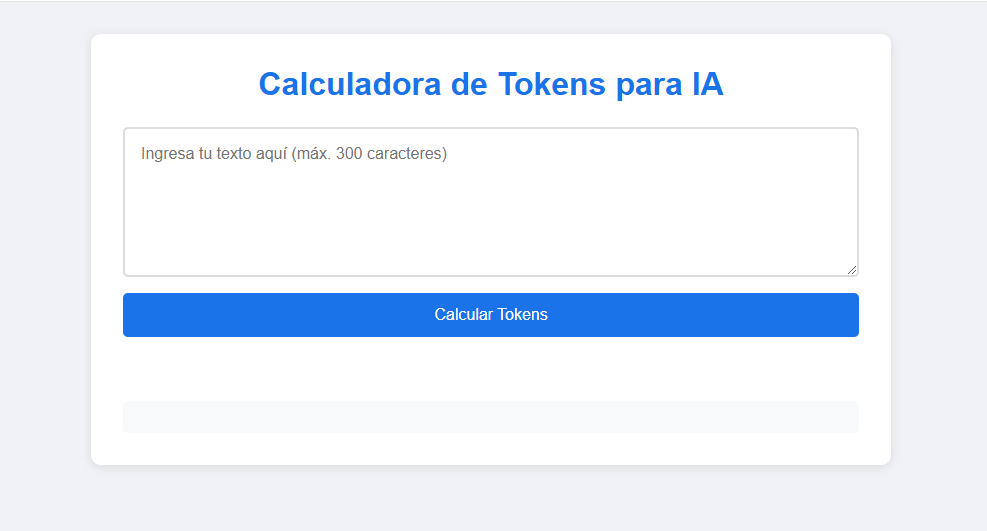

# Calculadora de Tokens para IA

Una aplicación web simple que permite calcular la cantidad aproximada de tokens utilizados en modelos de IA (como GPT) basándose en un texto ingresado por el usuario.

## Descripción

Este proyecto es una calculadora de tokens que estima cuántos tokens se generarían a partir de un texto de entrada. Los tokens son unidades de texto que los modelos de lenguaje como GPT utilizan para procesar información. La aplicación está diseñada para ser simple, rápida y fácil de usar.

## Características principales

- **Límite de 300 caracteres**: El campo de texto acepta un máximo de 300 caracteres.
- **Cálculo de tokens**: Estima la cantidad de tokens basándose en la relación aproximada de 1 token ≈ 4 caracteres.
- **Contador de caracteres en tiempo real**: Muestra cuántos caracteres se han ingresado y cuántos quedan disponibles.
- **Explicación del cálculo**: Proporciona una descripción detallada de cómo se realiza la estimación de tokens.
- **Diseño responsive**: Funciona en dispositivos móviles y de escritorio.
